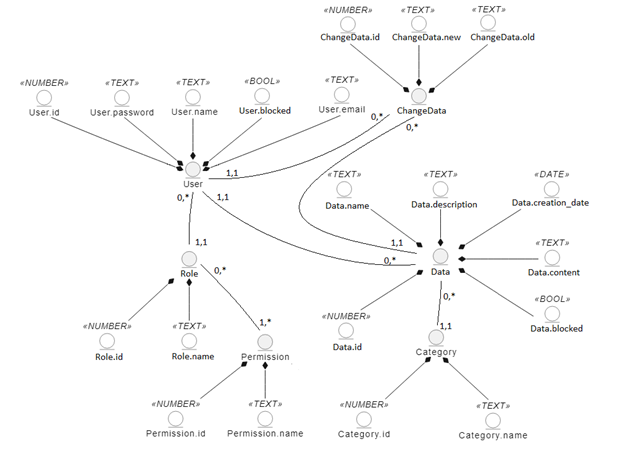
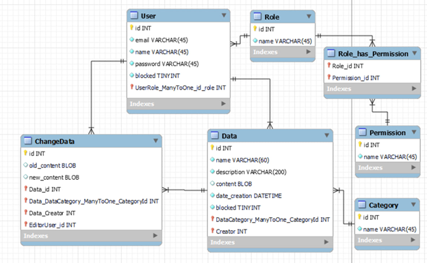

# Проєктування бази даних

## Модель бізнес-об'єктів 

## ER-модель
@startuml

    entity User{
      id: NUMBER
      email: TEXT
      name: TEXT
      password: TEXT
      blocked: BOOL
      }

    entity Data{
      id: NUMBER
      name: TEXT
      description: TEXT
      content: TEXT
      creation_date: DATE
      blocked: BOOL
      }

    entity Category{
      id: NUMBER
      name: TEXT
      }

    entity ChangeData{
      id: NUMBER
      old_content: TEXT
      new_content: TEXT
      }

    entity Role{
      id: NUMBER
      name: TEXT
      }

    entity Permission{
      id: NUMBER
      name: TEXT
      }

    User "1,1" -> "0,*" Data
    Data "1,1" --> "0,*" ChangeData
    User "1,1" --> "0,*" ChangeData
    Role "1,1" --> "0,*" User
    Permission "1,*" --> "0,*" Role
    Category "1,1" --> "0,*" Data

@enduml

## Реляційна схема

