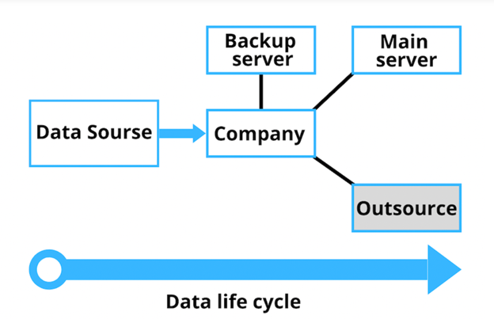
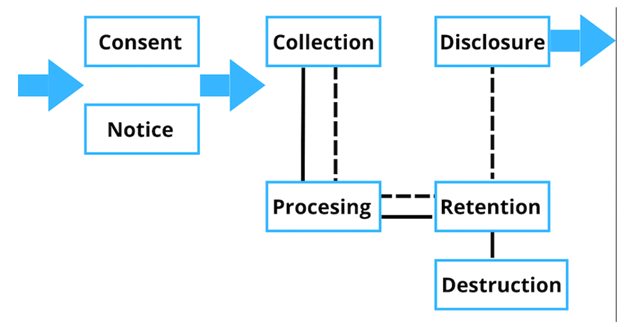

# Аналіз предметної області

## Вступ

У цьому документі міститься аналіз сфери управління відкритими даними. Документ включає різноманітні підходи, визначення та рішення, що використовуються для розв'язання поставлених задач. Крім того, описано існуючі інструменти для розв'язання цих задач та їх порівняння з планованою реалізацією проекту.

## Основні визначення

<b>Відкриті дані</b> <a href="https://uk.wikipedia.org/wiki/%D0%92%D1%96%D0%B4%D0%BA%D1%80%D0%B8%D1%82%D1%96_%D0%B4%D0%B0%D0%BD%D1%96">(1)</a> - це дані, які відкрито доступні для використання, обробки та розповсюдження без обмежень, що накладаються авторським правом, патентом чи іншими механізмами контролю доступу. Це означає, що відкриті дані можна використовувати для створення нових продуктів і послуг, проведення наукових досліджень, управління державою та розвитку державного сектора. Крім того, відкриті дані можна використовувати для створення програм і додатків, які допомагають покращити якість життя громадян. Щоб відкриті дані могли використовуватися іншими, вони повинні бути опубліковані у відкритому форматі та з використанням стандартів метаданих, які дозволяють легко розуміти та інтерпретувати дані. Також важливо, щоб відкриті дані були доступні через інтерфейс прикладного програмування (API), який дозволяє автоматизовано отримувати та обробляти дані. Відкриті дані можуть надавати різні організації та інституції, такі як державні установи, наукові установи, громадські організації та інші. Надання відкритих даних може стимулювати інновації та сприяти економічному розвитку, а також забезпечувати прозорість і відкритість управління.

<b>Управління відкритими даними</b> <a href="https://uk.wikipedia.org/wiki/%D0%94%D0%B0%D0%BD%D1%96">(2)</a> - це процес збору, зберігання, обробки, публікації та споживання відкритих даних, які є загальнодоступними. Цей процес включає використання технологій і методів для забезпечення належного зберігання та захисту відкритих даних, належної обробки даних для забезпечення їх якості та доступності, а також надання даних на платформах для їх подальшого використання. Однією з головних цілей управління відкритими даними є забезпечення відкритого доступу до даних для всіх зацікавлених сторін для забезпечення інновацій, розвитку та трансформації громадянського суспільства. Для досягнення цієї мети важливо не лише забезпечити відкритість даних, але й відповідність відповідним стандартам і нормативним вимогам щодо використання та доступу до цих даних. Управління відкритими даними має значний потенціал для покращення якості життя громадян та підтримки розвитку соціально-економічного середовища. Відкриті дані можна використовувати в різних сферах, таких як наука, освіта, медицина, бізнес, уряд і громадська безпека. Однак для досягнення цих цілей необхідно вирішити низку проблем, таких як: Б. Забезпечення якості та надійності даних, збереження конфіденційності, безпеки даних тощо

<b>Великі дані</b> <a href="https://uk.wikipedia.org/wiki/%D0%92%D0%B5%D0%BB%D0%B8%D0%BA%D1%96_%D0%B4%D0%B0%D0%BD%D1%96">(3)</a> – обсяги інформації (як структурованої, так і неструктурованої) настільки великі, що до них неможливо застосувати традиційні методи та підходи (в основному на основі рішень класу бізнес-аналітики та систем управління базами даних). Основні переваги використання технології включають:
  - Отримання якісно нових ідей завдяки всебічному аналізу всієї інформації в єдиному аналітичному сховищі. 
  - Розширення функціональності існуючих інформаційних систем підтримки бізнесу.
  - Підвищення ефективності використання апаратних ресурсів сервера. 
  - Забезпечення мінімальних витрат на використання всіх видів інформації завдяки можливості використання відкритого програмного забезпечення та хмарних технологій

<b>Відкритий код</b> <a href="https://uk.itpedia.nl/2011/03/15/wat-is-open-source/">(4)</a>- це підхід до розробки програмного забезпечення, який передбачає публічний доступ до вихідного коду програмного продукту. Це означає, що кожен може переглядати код, змінювати його або використовувати для створення власних продуктів. Відкритий вихідний код базується на принципах відкритості, співпраці та взаємодії, що дозволяє широкому співтовариству розробників працювати над однією програмою та вдосконалювати її. Такий підхід заохочує швидку розробку та вдосконалення програмного забезпечення, оскільки тисячі розробників можуть одночасно брати участь у проекті. Відкритий код не тільки дозволяє розробникам зосередитися на розробці програмного забезпечення, але також дозволяє компаніям і організаціям заощадити гроші, які раніше витрачалися на закриті ліцензії на програмне забезпечення. Багато відомих компаній, таких як Google, Facebook і Microsoft, використовують відкритий код для розробки своїх продуктів. Крім того, відкритий код дозволяє ширшій групі користувачів тестувати програмне забезпечення на помилки та прогалини в безпеці, що сприяє більш високому рівню безпеки та стабільності програмного забезпечення.

<b>API</b> <a href="https://en.wikipedia.org/wiki/API">(5)</a> - це набір протоколів, інструментів і стандартів, які дозволяють різним програмам програмного забезпечення взаємодіяти один з одним. API дозволяє програмі отримувати доступ до функцій і послуг іншої програми, що забезпечує їх інтеграцію та обмін даними. API можна розробити, щоб дозволити різним програмам програмного забезпечення взаємодіяти або отримувати доступ до послуг і ресурсів, що надаються через Інтернет. API може бути побудований на різних протоколах, таких як HTTP, REST, SOAP та інших. API дозволяє розробникам створювати програми, які використовують функціональність і служби інших програм, скорочуючи час і зусилля на розробку програмного забезпечення. Багато компаній і служб, які надають доступ до даних і функцій через API, також надають розробникам документацію та інструменти, які допомагають їм використовувати їхні послуги. API можна використовувати в багатьох сферах, як-от соціальні мережі, електронна комерція, фінансові послуги, ЗМІ, транспорт тощо. API дозволяє розробникам створювати нові програми та служби, які можна інтегрувати з іншими програмами та службами, покращуючи функціональність і взаємодію з користувачем

<b>База даних</b> <a href="https://hostiq.ua/wiki/ukr/database/">(6)</a> — це організована структура для зберігання, обробки та обробки пов’язаної інформації, зазвичай у великих обсягах. Бази даних активно використовуються для динамічних сайтів з великими обсягами даних - це найчастіше інтернет-магазини, портали та сайти компаній. Такі веб-сайти зазвичай розробляються з використанням серверної мови програмування (наприклад, PHP) або базуються на CMS (як-от WordPress) і не мають попередньо створених сторінок даних, як веб-сайти HTML

Основою бази даних є <b>модель даних</b> <a href="https://uk.wikipedia.org/wiki/%D0%9C%D0%BE%D0%B4%D0%B5%D0%BB%D1%96_%D0%B1%D0%B0%D0%B7_%D0%B4%D0%B0%D0%BD%D0%B8%D1%85">(6)</a>– фіксована система понять і правил представлення структури даних, стану і динаміки проблемної області в базі даних. У різні часи послідовно використовувалися ієрархічна, мережева та реляційна моделі даних. У наш час все більшого поширення набуває об'єктно-орієнтований підхід до організації баз даних
Система керування базами даних(8) — це набір взаємопов’язаних даних (база даних) і програм для доступу до цих даних. Надає можливості створювати, зберігати, оновлювати та шукати інформацію в базах даних разом із контролем доступу до даних
Підходи та способи вирішення завдання

## Системи відкритих даних в Україні

Системи відкритих даних в Україні контролюються <a href="https://thedigital.gov.ua/">Міністерством цифрової трансформації України</a>, яке забезпечує розробку та реалізацію державної політики відкритих даних. В Україні діє принцип стандартної відкритості – «відкрито за замовчуванням». Уся публічна інформація суб’єктів владних повноважень має бути оприлюднена у форматі відкритих даних та надаватися за запитом
Єдиний державний вебпортал відкритих даних, <a href="https://diia.data.gov.ua/info-center/odportals">data.gov.ua</a> — український урядовий вебсайт, де публікуються державні набори відкритих даних
Портал призначено для забезпечення надання доступу до публічної інформації у формі відкритих даних , він передбачає доступ до інформації органів державної влади та місцевого самоврядування з можливістю її наступного вільного використання (у тому числі в комерційних цілях) за умови обов'язкового посилання на джерело отримання такої інформації
Відкриті дані органів місцевого самоврядування містять інформацію найрізноманітнішого типу: 
-	Дані про використання публічних коштів і виконання бюджетів; 
-	Перелік укладених договорів і наданих адміністративних послуг; 
-	Перелік об’єктів комунальної власності, що передані в оренду, включно з даними про умови оренди; 
-	Відомості про лікарські засоби, придбані за бюджетні кошти, про їх розподіл між закладами охорони здоров’я та залишки в кожному з них; 
-	Дані про депутатів і поіменні результати їх голосування на пленарних засіданнях
Такі дані сприяють контролю за прозорістю й ефективністю місцевих органів влади
На момент <a href="https://ukraine.apps4cities.org/%D0%B2%D1%96%D0%B4%D0%BA%D1%80%D0%B8%D1%82%D1%96-%D0%B4%D0%B0%D0%BD%D1%96-%D0%BC%D1%96%D1%81%D1%82-%D0%BC%D1%96%D1%81%D1%82%D0%B0-%D0%BE%D0%B1%D0%BB%D0%B0%D1%81%D0%BD%D0%BE%D0%B3%D0%BE-%D0%B7%D0%BD/">дослідження</a>, яке провела ініціатива «Дані міст» у серпні 2019 року, власні портали відкритих даних мали вже 20 міст. У 60 міст обласного значення створили окремий розділ про відкриті дані на сайтах міських рад. На Єдиному державному веб-порталі відкритих даних набори оприлюднювали 108 міських рад

## Життєвий цикл даних

У широкому розумінні йдеться про період від моменту створення інформації та до моменту її повного зникнення в оригінальному вигляді

Життєвий цикл даних може мати такі етапи:
  -	Збір 
  -	Обробка
  -	Зберігання 
  -	Розкриття 
  -	Знищення

Додатково виділяють два етапи, що не належать до самого процесу обробки даних, але є важливими для визначення подальшого руху даних у системі: 
  -	Сповіщення 
  -	Запит

<b>Збір</b> – є першим етапом життєвого циклу та передбачає декілька підходів. Інформація може бути зібрана безпосередньо від джерела (прямий) або від третьої особи (не прямий)

<b>Сповіщення та запит</b> є обов’язковими для збору даних. Схематично ці етапи передують збору даних, проте з практичної точки зору не все так однозначно. Користувач має бути проінформований про збір його особистих даних. Перший варіант передбачає сповіщення, де зазначено, що продовження використання цього ресурсу автоматично означатиме згоду на збір даних (пасивний збір). Під другим варіантом мається на увазі отримання дозволу на збір інформації через запит та відповідну опцію у ньому (активний збір)

<b>Обробка</b> – процес, який є основною метою збору даних. Зазвичай етап обробки є унікальним для кожної компанії та може як включати взаємодію з працівниками компанії, так і бути повністю автоматичними. Досить часто в процесі обробки відкриваються можливості для використання даних не за прямим призначенням. Використання даних не первинним призначенням має бути кожного разу погоджено з користувачем. В іншому випадку подібні діє можуть суперечити місцевому законодавству чи міжнародним регламентам.

<b>Зберігання даних</b> – є ключовою точкою для життєвого циклу. В залежності від особливостей циклу та типу даних наступним етапом може стати розкриття, повторна обробка чи знищення. По своїй суті зберігання – це проміжковий етап, де дані можуть знаходитись поки від них є користь.

<b>Видалення</b> – це повне знищення даних. В залежності від типу даних існують різні методи видалення. Найбільш поширеним є типове видалення, як ми робимо у мобільних телефонах чи ноутбуках. Система перестає  бачити файли, однак нулі та одиниці, що його формували все ще залишаються на носії. З часом дані будуть перезаписані новим файлом, однак до того моменту видалені дані ще можливо відновити. Коли важливо впевнитись у неможливості відновлення данні використовують методики, що передбачають повний перезапис носія раптовими чи однаковими символами. У крайньому разі йдеться про фізичне знищення носія.

<b>Розкриття даних</b> – факультативний етап життєвого циклу. У ньому їдеться про розкриття та передачу інформації третім особам. Цей етап також можливо вважати джерелом інформації для іншого життєвого циклу даних.

## Модель даних DDF

<b>Модель даних DDF</b> <a href="https://support.google.com/drive/answer/6283888">(9)</a> — це спосіб упорядкування даних і визначення зв’язку частин даних між собою. Використовується для ідентифікації записів. Кожен набір даних DDF визначає п’ять наборів даних: поняття, метадані, сутності, точки даних і синоніми.

<b>Сутність</b> - мають одне значення в одиничному домені

<b>Домен сyтності</b> - це дискретне поняття, в якому визначені всі його можливі значення. Усі властивості для домену сутності також визначено мною

<b>Властивість</b> - додаткова інформація про деякі дискретні поняття. Існують також набори сутностей, які містять сутності, такі набори називаються наборами сутностей. Вони завжди стосуються певної області сутностей і не виходять за її межі

<b>Метадані</b> – як зазвичай, це дані про дані, тобто дані, які пояснюють інші дані. Різні дані можуть мати різні метадані. Метадані в DDF є властивістю однієї з пар ключ-значення.

<b>Синоніми</b>  – рядки, які дозволяють визначити поняття або сутність у наборі даних. а також із синонімами ідентифікаторів сутностей і понять у наборі сутностей

<b>Узгодження DDF</b> можна використовувати для узгодження даних, тобто воно може поєднувати дані з різних джерел в уніфікований, послідовний та унікальний набір даних. DDF підтримує практичний робочий процес, який забезпечує легке обслуговування та постійно зростаючий збір порівнянних даних

## Порівняльна характеристика існуючих засобів вирішення завдання

<a href="https://www.gapminder.org/about/"><b>Gapminder</b></a>

Gapminder – це незалежний шведський фонд, який не має політичної, релігійної чи економічної приналежності.
Gapminder виявляє систематичні неправильні уявлення про важливі глобальні тенденції та пропорції та використовує надійні дані для розробки простих для розуміння навчальних матеріалів, щоб позбавити людей від їхніх помилок.

<a href="https://www.worldbank.org/en/what-we-do"><b>The World Bank DataBank</b></a>

Група Світового банку працює у всіх основних галузях розвитку. Ми надаємо широкий спектр фінансових продуктів і технічну допомогу, а також допомагаємо країнам ділитися і застосовувати інноваційні знання та вирішення завдань, що стоять перед ними.
Їх політика доступу до інформації стала каталізатором таких ініціатив, як «Відкриті дані» та «Відкритий репозиторій знань»

<a href="https://www.google.com/publicdata/directory"><b>Google Public Data Explorer</b></a>

Інструмент, який дозволяє легко досліджувати, візуалізувати та ділитися великими наборами даних, що представляють суспільний інтерес. Дані можуть бути представлені у вигляді лінійних графіків, гістограм, перерізів або карт, які оновлюються з часом, що полегшує розуміння змін у світі

<a href="https://stat.gov.pl/en/"><b>Statistics Poland</b></a>

Головний громадський форум Польщі, який збирає та публікує статистичні дані щодо економіки країни, населення та суспільства на національному та місцевому рівнях

<a href="https://ec.europa.eu/eurostat/web/main/data/database"><b>Eurostat</b></a>

Євростат виробляє європейську статистику у партнерстві з національними статистичними інститутами та іншими національними органами в країнах-членах ЄС. Це партнерство відоме як Європейська статистична система. До нього також входять статистичні органи країн Європейської економічної зони  і Швейцарії

<a href="https://dataverse.org/"><b>Dataverse</b></a>

Проект Dataverse — це веб-програма з відкритим вихідним кодом для обміну, збереження, цитування, вивчення та аналізу даних досліджень. Це полегшує доступ до даних для інших і дозволяє легше копіювати роботу інших. Дослідники, журнали, автори даних, видавці, розповсюджувачі даних і афілійовані установи отримують академічні кредити та видимість в Інтернеті

## Порівняльна таблиця

💚 -  задовільно

💛 – добре

❤ -  погано

🖤 -  немає

| Вимоги         | Критерії                    | Gapminder | The World Bank DataBank | Google Public Data Explorer | Statistics Poland | Eurostat | Dataverse |
| :------------: | :-------------------------: | :-------: | :---------------------: | :-------------------------: | :---------------: | :------: | :-------: |
| Functionality  |                             |           |                         |                             |                   |          |           |
|                | Керування наборами даних   |     🖤     |           🖤            |             💚              |        🖤          |    🖤     |    💚     |
|                | Візуалізація даних         |     💚     |           💛            |             ❤               |        💛          |    ❤     |    💚     |
|                | Тематичне розбиття даних   |     💚     |           💚            |             💚              |        💛          |    💚     |    💛     |
|                | Пошуковий фільтр           |     💚     |           💛            |             💚              |        💛          |    💛     |    💚     |
|                | Donate system              |     💚     |           🖤            |             🖤              |        🖤          |    🖤     |    🖤     |
| Usability      |                            |             |                         |                             |                     |            |           |
|                | Підтримка англійської мови |     💚     |           💚            |             💚              |        💚          |    💚     |    💚     |
|                | Документація               |     💛     |           🖤            |             💚              |        💛          |    💚     |    💚     |
|                | User-friendly interface    |     💚     |           ❤             |             💛              |        💛          |    ❤     |    💚     |
| Reliability    |                            |           |                         |                             |                   |          |           |
|                | Ліцензія                   |     💚     |           💚            |             💚              |        ❤           |    💚     |    💚     |
|                | Резервне копіювання        |     💚     |           💚            |             💚              |        💚          |    💚     |    💚     |
|                | Актуальність даних         |     💛     |           💛            |             💚              |        💚          |    💚     |    💛     |
|                | Performance                |           |                         |                             |                   |          |           |
|                | Оцінка PageSpeed Insights  |     💛     |           💛            |             💛              |        💛          |    ❤     |    ❤     |
|                | Стійкість до збоїв         |     💚     |           💚            |             💚              |        💚          |    💚     |    💚     |
| Supportability |                            |             |                         |                              |                    |           |           |
|                | FAQ                        |     💚     |           💚            |             💚              |        🖤          |    💚     |    🖤     |
|                | Онлайн підтримка           |     💚     |           💚            |             💚              |        💚          |    💚     |    💚     |

## Висновки

У результаті аналізу наша команда дійшла висновку, що серед існуючих засобів вирішення проблеми немає ідеального інструменту, який би відповідав потребам і мав достатню функціональність для вирішення проблеми управління відкритими даними. 
Тому було вирішено створити нову веб-систему для реалізації всього життєвого циклу даних, надаючи користувачеві всі необхідні інструменти для роботи з відкритими даними.

## Посилання

https://cedos.org.ua/researches/vidkryti-dani-v-ukrayini-dosyagnennya-perevagy-zasterezhennya/

https://legalitgroup.com/zhittyevij-tsikl-danih/#:~:text=%D0%A3%20%D1%88%D0%B8%D1%80%D0%BE%D0%BA%D0%BE%D0%BC%D1%83%20%D1%80%D0%BE%D0%B7%D1%83%D0%BC%D1%96%D0%BD%D0%BD%D1%96%20%D0%B9%D0%B4%D0%B5%D1%82%D1%8C%D1%81%D1%8F%20%D0%BF%D1%80%D0%BE,%D0%BF%D0%BE%D0%B2%D0%BD%D0%BE%D0%B3%D0%BE%20%D0%B7%D0%BD%D0%B8%D0%BA%D0%BD%D0%B5%D0%BD%D0%BD%D1%8F%20%D0%B2%20%D0%BE%D1%80%D0%B8%D0%B3%D1%96%D0%BD%D0%B0%D0%BB%D1%8C%D0%BD%D0%BE%D0%BC%D1%83%20%D0%B2%D0%B8%D0%B3%D0%BB%D1%8F%D0%B4%D1%96.

https://www.gapminder.org/

https://www.worldbank.org/en/

https://uk.itpedia.nl/2011/03/15/wat-is-open-source/

https://www.google.com/publicdata/directory?hl=en

https://stat.gov.pl/en/

https://ec.europa.eu/eurostat/web/main/home

https://dataverse.org/

https://uk.wikipedia.org/wiki/%D0%94%D0%B0%D0%BD%D1%96
https://hostiq.ua/wiki/ukr/database/
