# Тестування працездатності системи

### GUEST_AUTHORIZATION
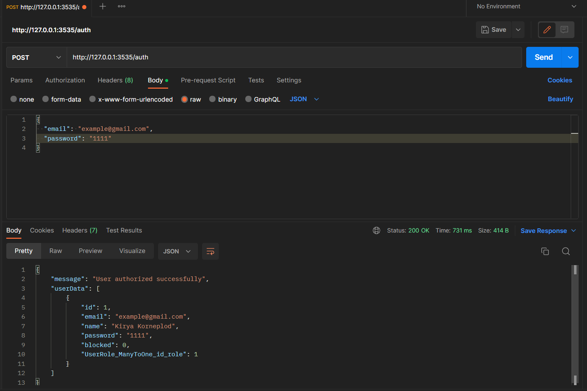
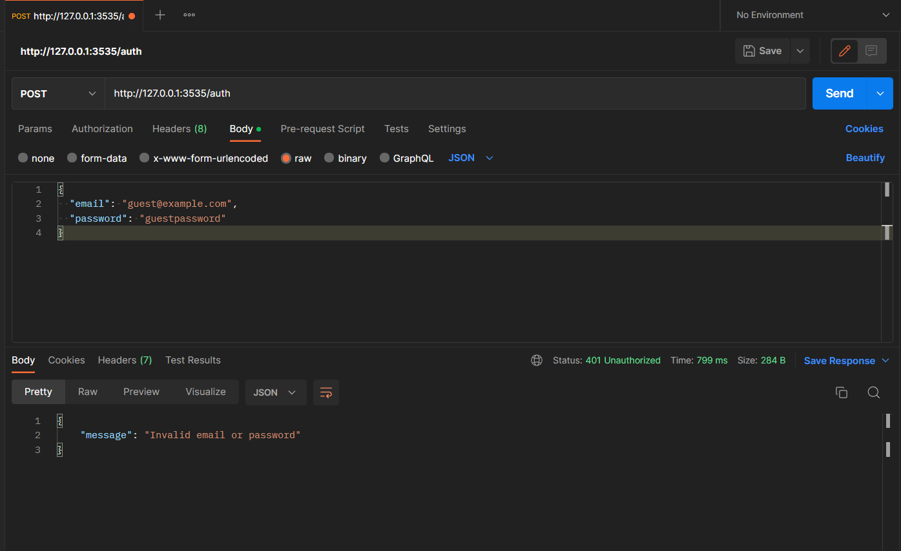

### GUEST_REGISTRATION
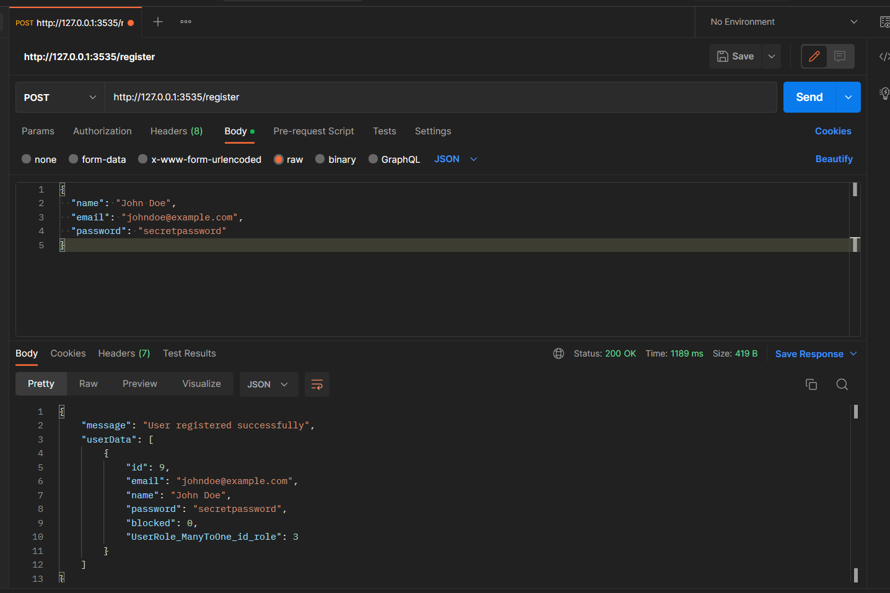

### GUEST_VIEW
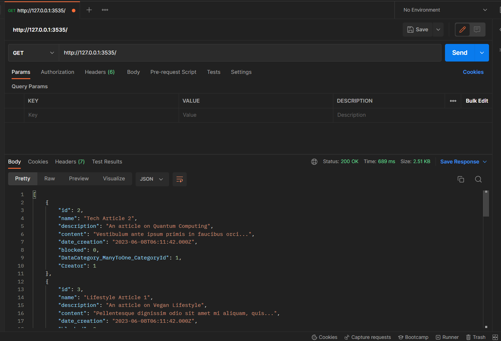

### USER_GENERATE_TABLE
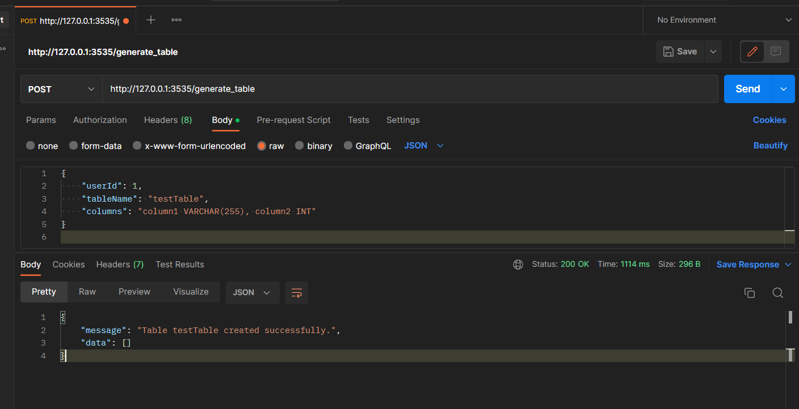

### USER_ADD_DATA
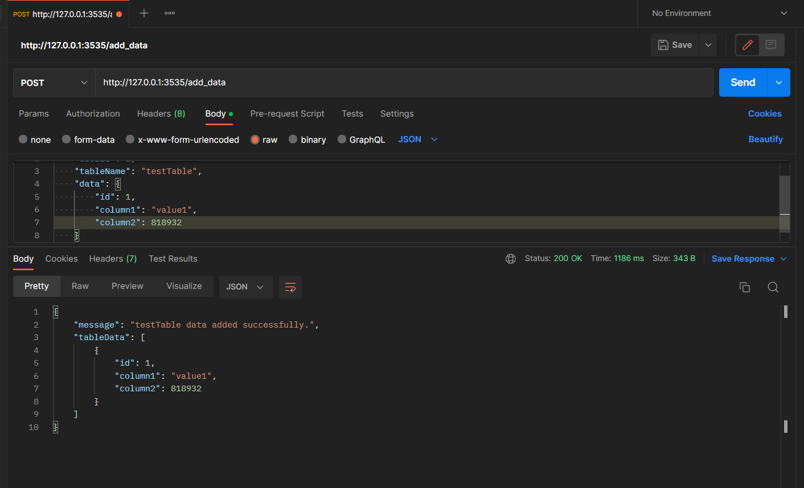

### USER_CHANGE_DATA
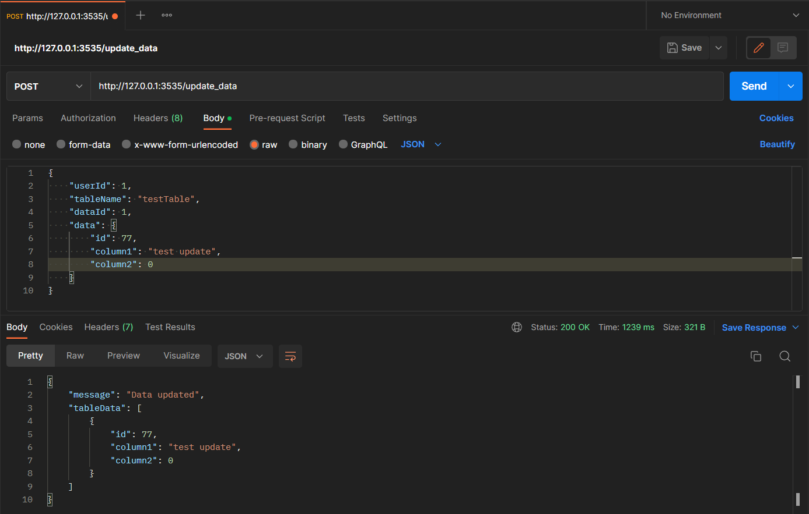
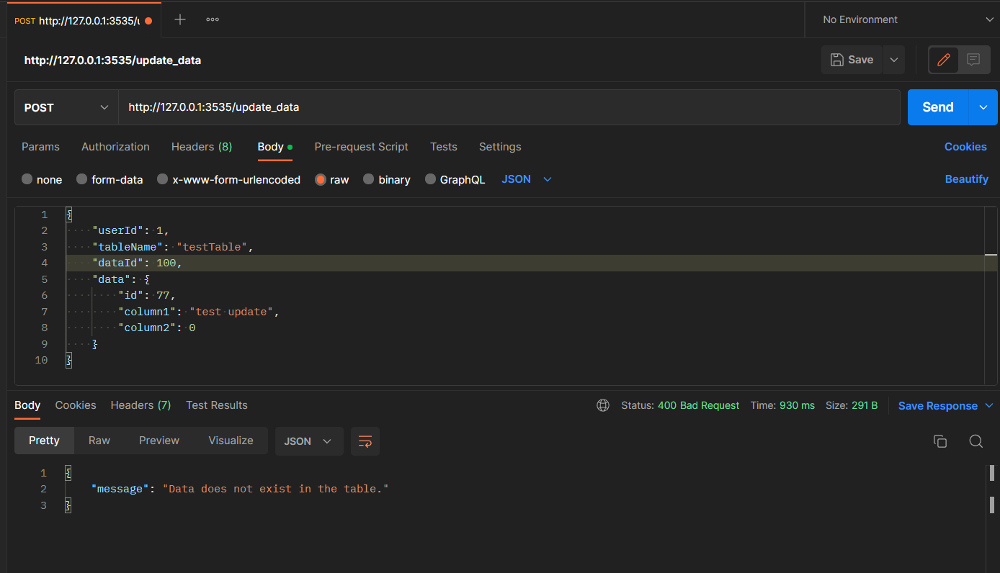

### ADM_DELETE_DATA
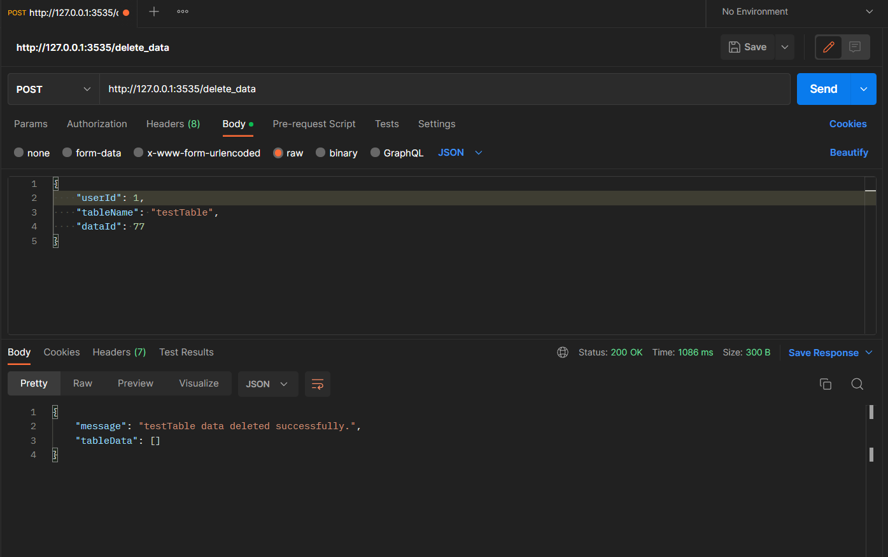
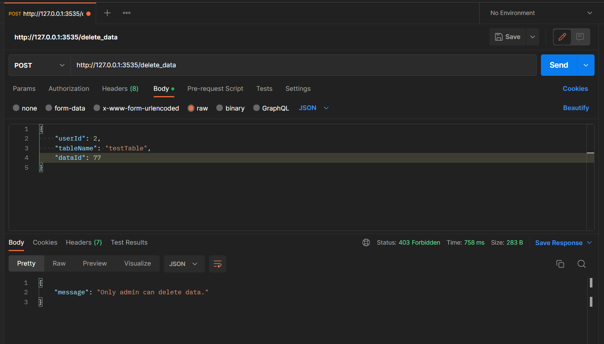

### ADM_BLOCK_USER
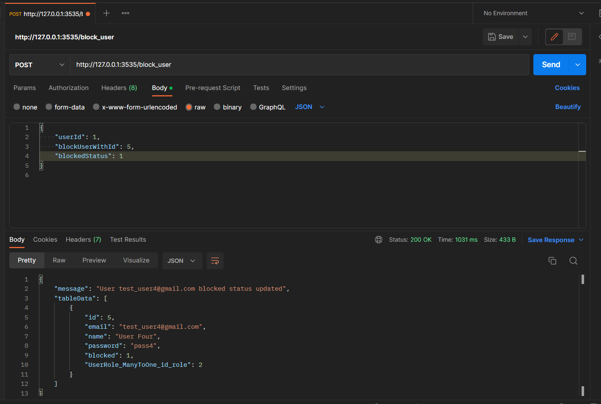
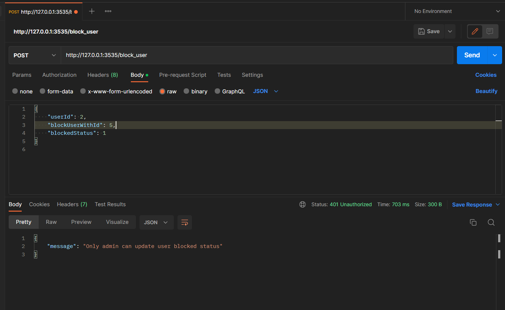

### ADM_MAKE_NEWADM
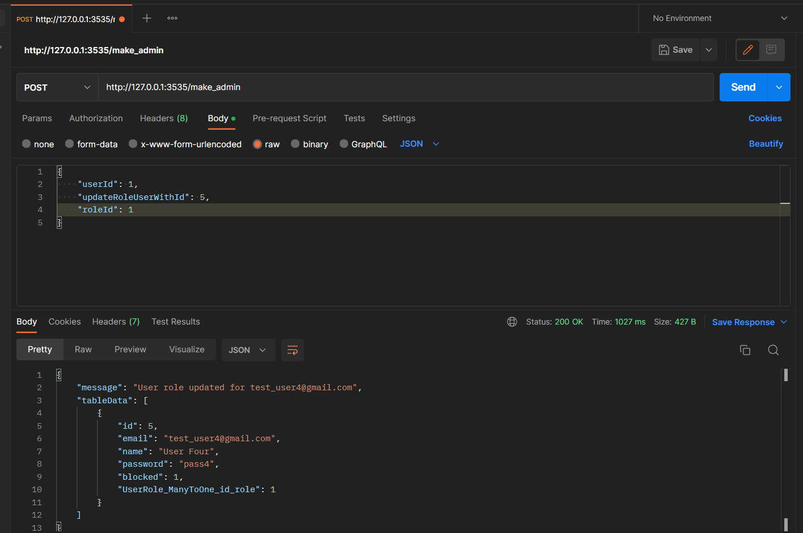
